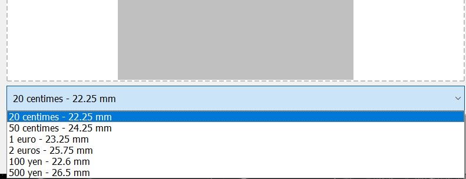

# Analysis-of-Industrial-Tool-Images

# Table des Matières

- [Analysis-of-Industrial-Tool-Images](#analysis-of-industrial-tool-images)
- [Table des Matières](#table-des-matières)
  - [1. Introduction](#1-introduction)
  - [2. Installation](#2-installation)
    - [Téléchargement du logiciel](#téléchargement-du-logiciel)
    - [Installation des dépendances avec pip](#installation-des-dépendances-avec-pip)
  - [3. Démarrage de l'application](#3-démarrage-de-lapplication)
    - [Conseils pour une mesure précise](#conseils-pour-une-mesure-précise)
    - [Interface principale](#interface-principale)
  - [4. Mesure du Diamètre](#4-mesure-du-diamètre)
  - [5. Utilisation de l'interface de mesure de pas](#5-utilisation-de-linterface-de-mesure-de-pas)
    - [Étapes pour mesurer le pas](#étapes-pour-mesurer-le-pas)
  - [6. Dépannage](#6-dépannage)
    - [Problèmes communs et solutions](#problèmes-communs-et-solutions)
  - [7. FAQ](#7-faq)
    - [Questions Fréquentes](#questions-fréquentes)

## 1. Introduction

Le projet "Analyse d’images d’outils industriels" vise à simplifier et à optimiser le processus de sélection d’outils de filetage pour les clients. Utilisant une technologie de pointe en reconnaissance d'images, cette initiative permet de photographier un filetage et d'obtenir rapidement une recommandation précise pour le taraud ou la filière correspondante. 
Ce projet, focalisé initialement sur les filetages mâles, représente une étape clé vers la modernisation de l'expérience client chez Outillage de l'Atlantique.

Ce manuel est destiné à vous guider dans l'utilisation de notre application de reconnaissance d'images pour identifier rapidement et avec précision la filière adéquate pour tout filetage mâle. 
En suivant les instructions détaillées et illustrées, vous serez capable de charger des images de filetages, utiliser l'interface pour mesurer les caractéristiques nécessaires et recevoir des recommandations de produits adaptés à vos besoins.

## 2. Installation

### Téléchargement du logiciel

Pour commencer à utiliser l'application de reconnaissance d'images pour outils de filetage, vous devez d'abord télécharger les fichiers nécessaires. Suivez ces étapes :

- Clonez le dépôt GitHub en utilisant la commande suivante :
git clone https://github.com/AdrienLibert/Analysis-of-Industrial-Tool-Images.git

### Installation des dépendances avec pip

L'application nécessite l'installation de certaines dépendances logicielles pour fonctionner correctement. Ces dépendances seront gérées par pip, le gestionnaire de paquets pour Python. 
Assurez-vous d'avoir Python 3.2.13 installé sur votre machine avant de procéder. 
Suivez ces instructions pour installer les dépendances requises :

1. Ouvrez un terminal sur votre ordinateur.
2. Naviguez jusqu'au dossier où vous avez téléchargé les fichiers. Si vous avez utilisé la commande de clonage Git mentionnée précédemment, entrez dans le dossier créé par Git :
cd Analysis-of-Industrial-Tool-Images

1. Une fois dans le dossier, localisez le fichier `requirements.txt`. Ce fichier contient la liste de toutes les dépendances nécessaires pour l'application.
2. Exécutez la commande suivante pour installer toutes les dépendances :
pip install -r requirements.txt

## 3. Démarrage de l'application

Après avoir installé avec succès toutes les dépendances nécessaires, vous êtes prêt à démarrer l'application. Suivez ces étapes pour lancer l'application et accéder à l'interface principale :

1. Assurez-vous que vous êtes toujours dans le répertoire où se trouve le fichier `main.py`, ou naviguez vers celui-ci en utilisant la commande `cd`.

    cd SRC

2. Lancez l'application en exécutant le fichier `main.py` avec Python. Assurez-vous d'utiliser la version Python avec laquelle vous avez installé les dépendances (Python 3.2.13 dans ce cas).

    python main.py

3. Une fois l'application lancée, vous devriez voir l'interface utilisateur principale s'afficher sur votre écran. Cette interface vous permettra de charger des images de filetage et d'effectuer les mesures nécessaires.

### Conseils pour une mesure précise

- **Éclairage uniforme** : Assurez-vous que l'éclairage de l'image est uniforme pour éviter les ombres qui pourraient affecter la précision des mesures. Un éclairage direct et bien réparti est essentiel.
- **Qualité de l'image** : Utilisez des images nettes et claires ; la netteté de l'image est cruciale pour une mesure précise. Évitez toute forme de flou ou de distorsion.
- **Arrière-plan de l'image** : Positionnez le filetage à mesurer au centre d'une feuille blanche pour garantir un contraste élevé et faciliter la détection des contours. La pièce de référence doit être placée à côté du filetage, sur les côtés, pour aider à calibrer correctement les dimensions dans l'analyse.

### Interface principale

L'interface principale est conçue pour être intuitive et facile à utiliser. 
Vous trouverez des boutons pour charger les images, ainsi que des outils pour sélectionner les zones à mesurer. Prenez un moment pour vous familiariser avec les différentes options disponibles.

## 4. Mesure du Diamètre

L'application vous permet de mesurer précisément le diamètre des filetages à partir des images téléchargées. 
Pour calibrer correctement les mesures, une pièce de référence de taille connue doit être utilisée lors de l'analyse de votre filetage. Voici comment procéder :

1. **Chargement de l'image** : Cliquez sur le bouton 'Charger une image' dans l'interface principale. Sélectionnez l'image du filetage que vous souhaitez analyser, en vous assurant que la pièce de référence est également visible sur l'image.

2. **Entrée de la taille de la pièce de référence** : Choisissez les dimensions de la pièce de référence utilisée. Cette étape est cruciale pour que l'application puisse calibrer les mesures en fonction de la taille réelle de la pièce.
  

1. **Sélection de la zone à mesurer** : Sélectionnez un point sur un picot en haut du filetage et le deuxième point sur le picot en bas du filetage. Cette méthode permet de cibler précisément les extrémités du filetage pour une mesure exacte du diamètre.

2. **Mesure du diamètre** : Une fois la zone sélectionnée et la taille de la pièce de référence entrée, l'application calculera automatiquement le diamètre en pixels et le convertira en millimètres ou dans une autre unité de mesure basée sur la dimension de la pièce de référence.

3. **Résultats** : Les résultats de la mesure seront affichés dans l'interface. Vous pourrez voir le diamètre mesuré ainsi que d'autres informations pertinentes calculées par l'application.

## 5. Utilisation de l'interface de mesure de pas

Après avoir mesuré le diamètre, l'étape suivante est de mesurer le pas du filetage. 
L'interface de mesure de pas vous permet de déterminer précisément le pas des filetages à partir de l'image chargée.

### Étapes pour mesurer le pas

1. **Sélection de l'outil de mesure de pas** : Dans l'interface principale, après avoir mesuré le diamètre, sélectionnez l'outil 'Mesure de pas'.

2. **Application de l'outil de mesure** : Avec l'outil de mesure de pas activé, cliquez sur le début du filetage et faites glisser l'outil jusqu'à la fin d'une section complète de filetage pour mesurer le pas.

3. **Lecture des résultats** : L'application calculera et affichera le pas en millimètres ou dans une autre unité spécifiée. Vous pourrez voir le pas mesuré directement dans l'interface.

## 6. Dépannage

### Problèmes communs et solutions

- **L'application ne démarre pas** :
  - Vérifiez que toutes les dépendances ont été correctement installées.
  - Assurez-vous que vous utilisez la bonne version de Python (Python 3.2.13).

- **L'outil de mesure ne fonctionne pas correctement** :
  - Assurez-vous que l'image chargée est de haute qualité et bien éclairée.

- **Erreurs lors de la mesure du diamètre ou du pas** :
  - Vérifiez que l'image est correctement alignée et que le filetage est clairement visible.

## 7. FAQ

### Questions Fréquentes

- **Q1 : Quelles sont les exigences système pour l'application ?**
  - **R1 :** L'application nécessite Windows 10 ou supérieur, Python 3.2.13, et les dépendances spécifiées dans le fichier `requirements.txt`.

- **Q2 : Comment puis-je améliorer la précision des mesures dans l'application ?**
  - **R2 :** Assurez-vous que l'image est claire et bien éclairée. Utilisez des images avec un bon contraste et évitez les ombres ou les reflets. En outre, veillez à ce que le filetage soit complètement visible dans l'image pour une meilleure précision.

- **Q3 : Que faire si l'application ne reconnaît pas le filetage sur l'image ?**
  - **R3 :** Assurez-vous que l'image n'est pas floue et que le filetage est clairement visible. Vous pouvez également essayer de recharger l'image ou d'utiliser une image avec une perspective et un éclairage différents.

- **Q4 : L'application est-elle capable de mesurer les filetages femelles ?**
  - **R4 :** Actuellement, le projet est concentré sur les filetages mâles. La mesure des filetages femelles est prévue pour les versions futures de l'application.

- **Q5 : Puis-je utiliser l'application sur un appareil mobile ?**
  - **R5 :** Non, actuellement l'application est uniquement disponible pour les systèmes d'exploitation de bureau comme Windows et macOS.
